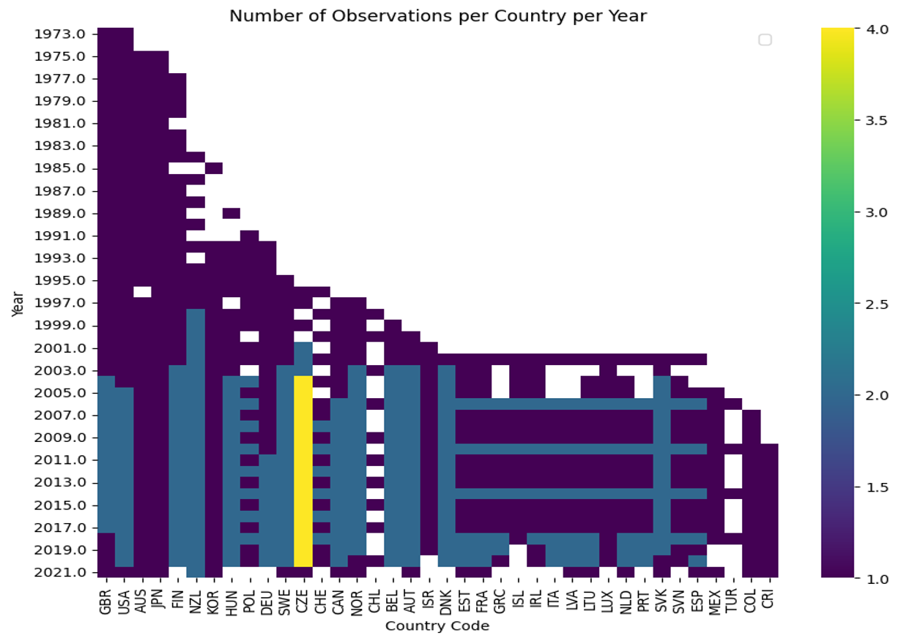
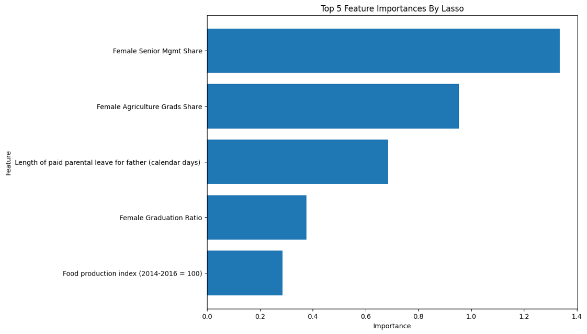

# Gender Wage Gap Analysis

This project focuses on analyzing the gender wage gap across OECD countries. The aim is to identify patterns and trends across various sectors that could potentially explain the disparities in gender wage gaps among these countries.

## Data Sources

The datasets for this project were gathered from the official OECD and World Bank databases:
- [OECD Gender Wage Gap Data](https://data.oecd.org/earnwage/gender-wage-gap.htm)
- [World Bank Gender Statistics](https://databank.worldbank.org/source/gender-statistics)

The data covers sectors such as economy, education, government, jobs, society, health, innovation and technology, and finance.

## Data Preprocessing

The data preprocessing phase involved several steps:

1. **Handling Missing Values**: Columns with more than 50% missing values were dropped. The remaining missing values were imputed using the K-Nearest Neighbors (KNN) algorithm.

2. **Country Filtering**: Countries with more than 5 years of missing data from 2000 to 2020 were excluded from the analysis.

3. **Data Imputation**: Missing values were imputed using the KNN method with k=1, which yielded the most reliable imputation results for the dataset. KNN was chosen because it can handle multivariate data and considers the relationships between features. However, it's important to note that imputation methods like KNN can introduce their own biases and inaccuracies.

Heatmap of Missing Values

Number of Missing Values vs Year 

## Feature Selection

Lasso regression was used for feature selection. The LassoCV function from the scikit-learn library was employed to find the optimal amount of penalization. Lasso regression selected 75 variables and eliminated 52 variables, with an optimal alpha of 0.316228.

Top 5 Feature Importances by Lasso

## Exploratory Data Analysis (EDA)

The EDA section includes outlier detection and visualization, cross-country outlier analysis, multivariate outlier analysis, and correlation analysis.

Outlier Detection and Visualization

Cross-country Outlier Analysis

Multivariate Outlier Analysis

Correlation Analysis

## Data Preprocessing
Three main biases have been identified within the dataset:
1. **Selection Bias**: Given that the data is collected from specific sources, it might not represent all countries equally. Some countries might be underrepresented or overrepresented in the data. To mitigate this, multiple datasets from different sources (OECD and World Bank) were used to help diversify the data and reduce this bias.
2. **Time Range Bias**: The decision to use data from 2000 onwards might introduce bias, as it excludes earlier years. This could potentially overlook long-term trends or changes in the gender wage gap. While this might introduce some bias, it ensures that the analysis is based on more reliable and relevant data.
3. **Missing Data Bias**: The handling of missing data, particularly the decision to drop countries with more than 5 years of missing data, could introduce bias. This might result in an overrepresentation of countries with more complete data. KNN was used to fill those missing values based on the relationships observed in the data, which can provide a more accurate representation than simply dropping or filling with average values.

## Machine Learning Models

Three robust machine learning models were employed: Decision Tree, Random Forest, and XGBoost. These models were chosen because they can handle a large number of features, complex interactions, and are known for their robustness against outliers and non-linear relationships.
The models were trained on 80% of the data, with the remaining 20% held out for validation. Mean Absolute Error (MAE) was used as the evaluation metric.

The Random Forest model achieved the lowest MAE, indicating that it was the most accurate of the three models.

Model Performance

## Future Work and Improvement

Suggestions for future work and improvement include:

1. Country-specific analysis focusing on countries with higher prediction errors.
2. Expanding the temporal scope by incorporating data from earlier years.
3. Exploring alternative modeling techniques such as deep learning models.
4. Conducting domain-specific investigations into well-performed features.

## Repository Structure

- `data/`: Contains the raw and preprocessed datasets.
- `notebooks/`: Jupyter notebooks used for data preprocessing, EDA, and modeling.
- `plots/`: Generated plots and visualizations.
- `report/`: Final report and presentation files.
- `README.md`: Overview of the project and its findings.
 
